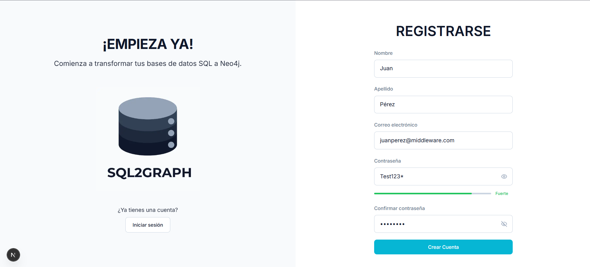
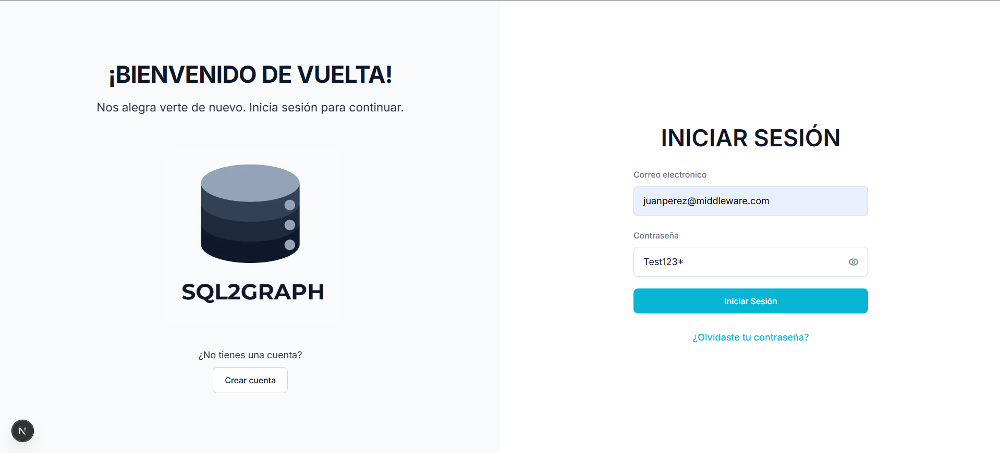
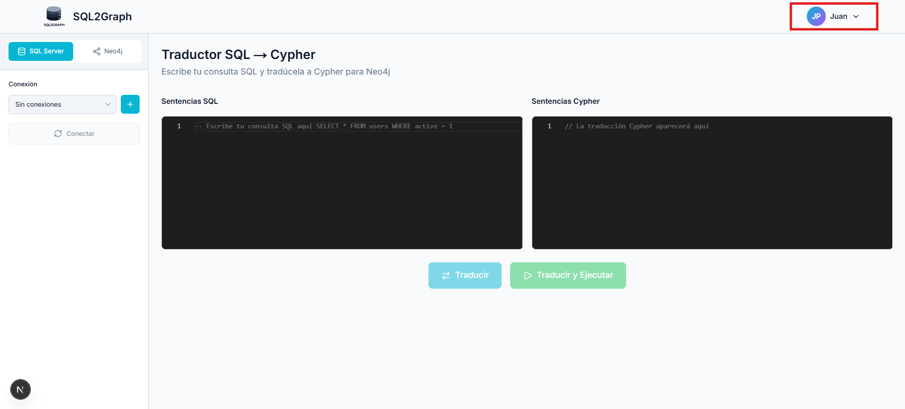
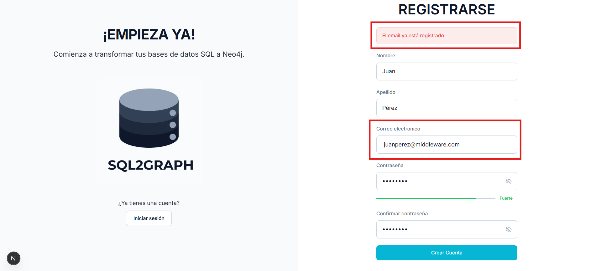

# Resultados de Caso de Prueba CP-01

## Registrar usuario exitosamente

| ID    | Descripción                              | Resultado |
| ----- | ---------------------------------------- | --------- |
| CP-01 | Registro de nuevo usuario                | Exitoso   |
| CP-01 | Intento de registro con correo existente | Fallido   |

## Resultados

### Registro de nuevo usuario
1. Ingreso de campos para registro

2. Redirección al login

3. Inicio de sesión exitoso con el usuario registrado

---

### Intento de registro con correo existente

1. Ingreso de credenciales del usuario previamente registrado

