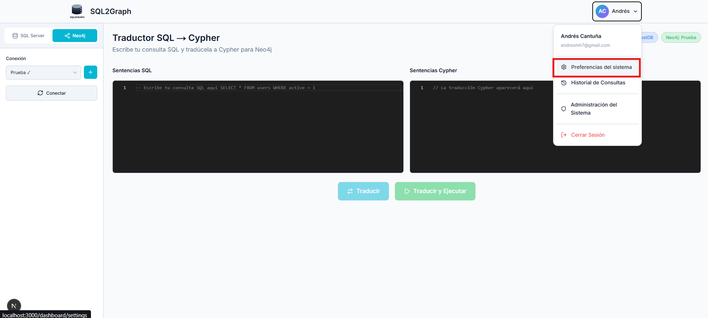
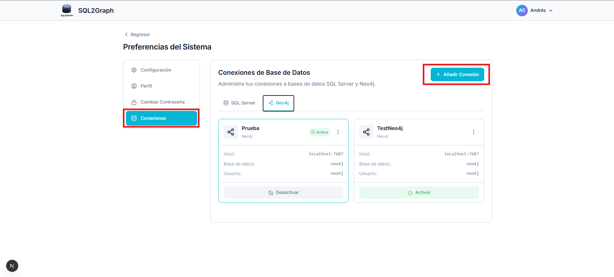
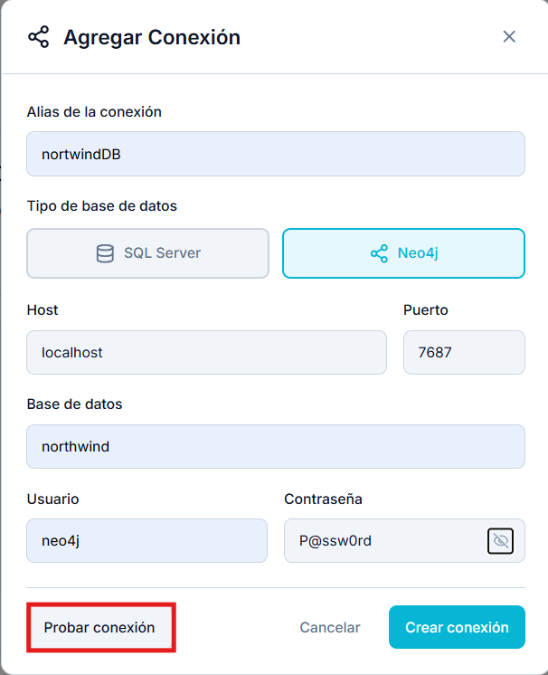
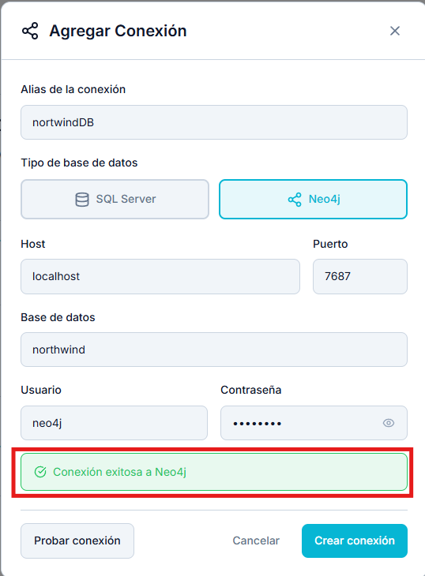

# Resultados de Caso de Prueba CP-02

## Agregar conexión a base de datos en Neo4j

| ID    | Descripción                     | Resultado |
| ----- | ------------------------------- | --------- |
| CP-02 | Agregar conexión válida a Neo4j | Exitoso   |

## Resultados

### Agregar conexión válida a Neo4j
1. Ingreso a preferencias del sistema

2. Selección de opción `Conexiones` y `Añadir Conexión`

3. Completar campos para agregar conexión

4. Prueba de conexión y guardar conexión.

5. Conexión guardada exitosamente

