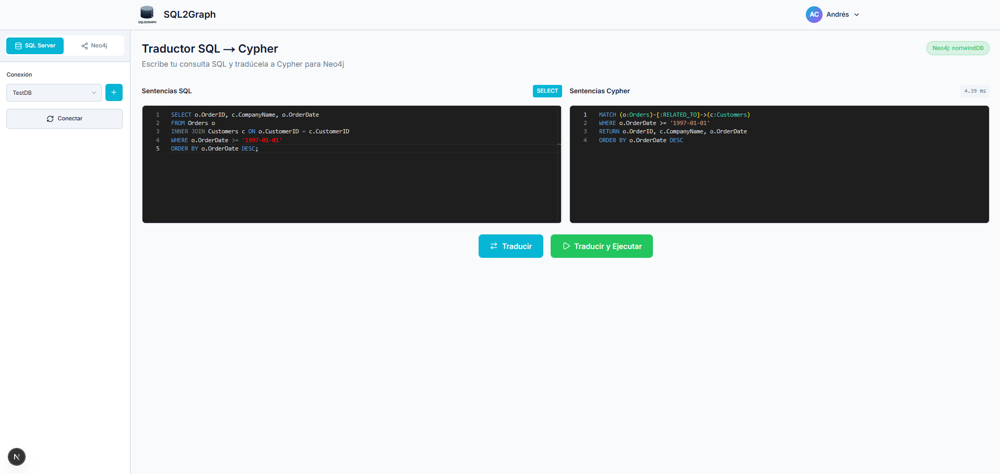

# Resultados de Caso de Prueba CP-04

## Traducir consultas SELECT con INNER JOIN

| ID    | Descripción                                  | Resultado |
| ----- | -------------------------------------------- | --------- |
| CP-03 | Traducir consultas `SELECT` con `INNER JOIN` | Exitoso   |

## Resultados

### Traducir consultas SELECT con INNER JOIN

1. Acceso a pantalla de traducción y traducción de consulta `SELECT` con `INNER JOIN`
   
