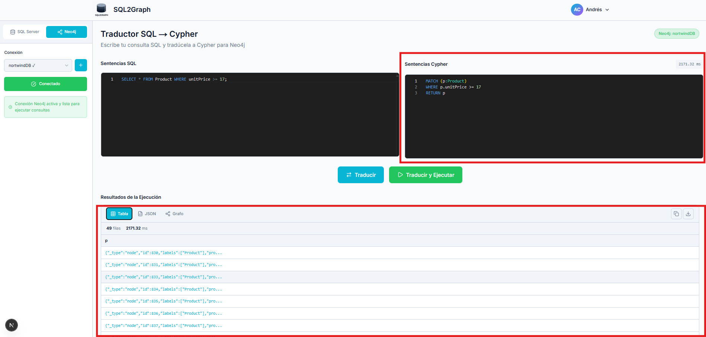
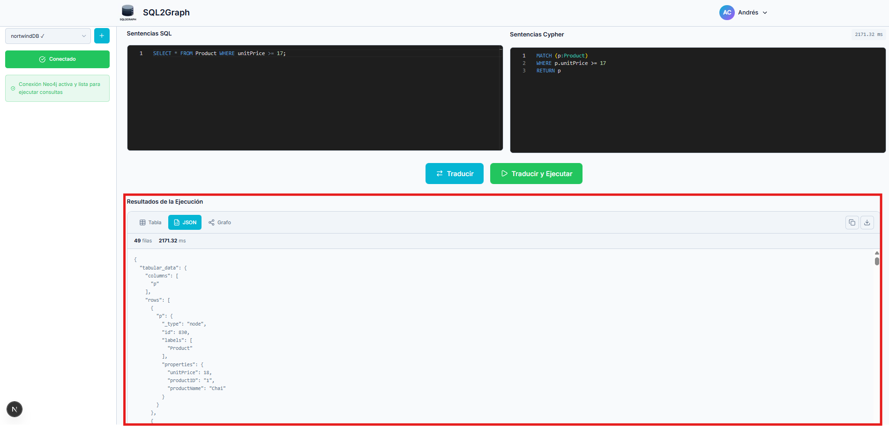
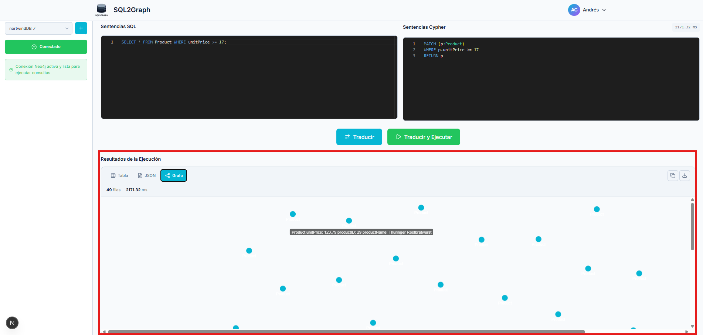

# Resultados de Caso de Prueba CP-05

## Ejecutar consulta traducida y visualizar resultados

| ID    | Descripción                                         | Resultado |
| ----- | --------------------------------------------------- | --------- |
| CP-05 | Ejecutar consulta traducida y visualizar resultados | Exitoso   |

## Resultados

### Ejecutar consulta traducida y visualizar resultados

1. Ejecución de consulta y visualización de resultados en formato Tabla.
   
2. Ejecución de consulta y visualización de resultados en formato JSON.
   
3. Ejecución de consulta y visualización de resultados en formato Grafos.
   
