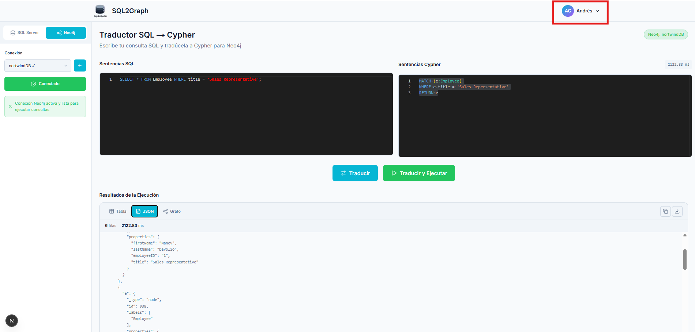
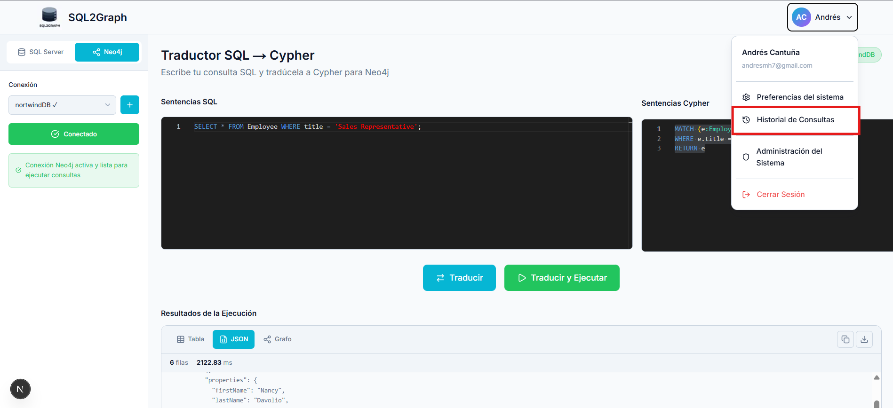
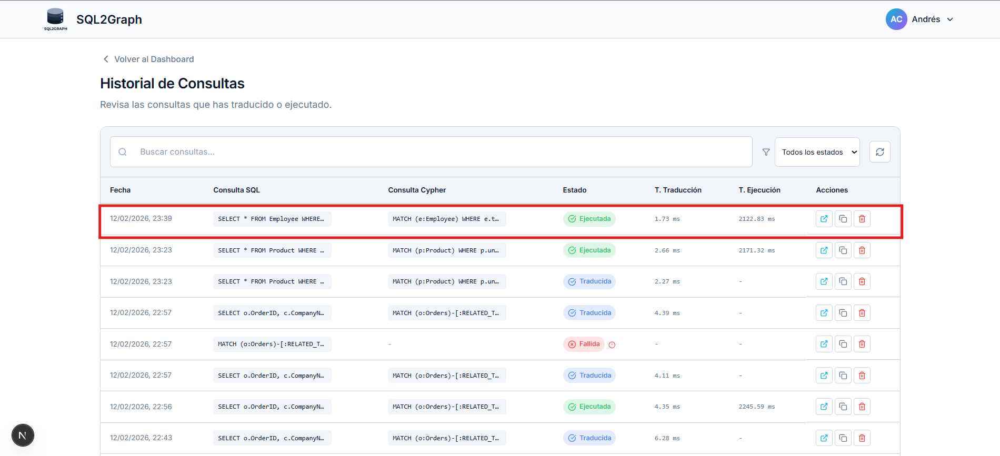

# Resultados de Caso de Prueba CP-06

## Registrar consulta en el historial

| ID    | Descripción                                         | Resultado |
| ----- | --------------------------------------------------- | --------- |
| CP-06 | Registrar consulta en el historial | Exitoso   |

## Resultados

### Registrar consulta en el historial

1. Ejecución de consulta.
   
2. Selección de opción Historial de Consultas.
   
3. Visualización del historial de consultas y validación de consulta registrada con etiqueta `EJECUTADA`.
   
